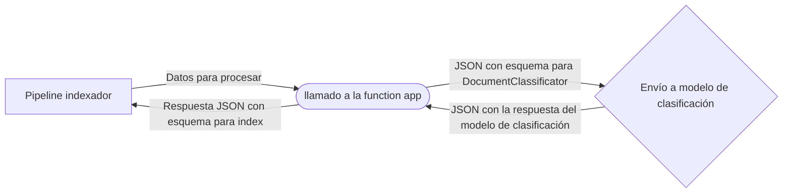

# Creación de una Skill de texto para integrar en un pipeline de enriquesimiento de index

Para crear una skill de texto para integrar a un [[indexador]] de [[azure search]]; se necesita: crear un modelo de texto (con azure language) y una function app (con Azure Functions) que integre el modelo de texto en el pipeline de enriquecimiento.

# Overview

1. Establecimiento del dataset y el índice con Azure Search
2. Creación de un modelo de lenguage (en este caso un modelo de clasificación de texto)
3. Creación de una Azure Function App para integrar el modelo de lenguaje en el pipeline de enriquecimiento.
4. Configurar la inte3gración de la Azure Function App en el pipeline de enriquecimiento.
    1. Actualizar el indez para reflejar los campos de salida de la Azure Function App.
    2. Actuializar el skillset de enriquecimiento para incluir la Azure Function App.
    3. Mapear la respuesta del skillset en el índice

## Creación de La Azure Function App 

Ya que la creación del índice, la creación, entrenamiento y evaluación del modelo de lenguaje son temas de otros documentos; en este documento se abordarán las características específicas que debe tener la Azure Function App para integrar el modelo de lenguaje en el pipeline de enriquecimiento.

La forma de integrar un clasificador de texto en un pipeline de enriquecimiento es a través de una Azure Function App. La Azure Function App es una aplicación que se ejecuta en la nube de Azure y que se puede configurar para ejecutar una función específica en respuesta a un evento específico. En este caso, la Azure Function App se configurará para ejecutar una función que llame al modelo de clasificación de texto en respuesta a un evento específico. 

Las interfaces entre los componentes de este proceso son archivos JSON que contienen los datos de entrada y salida de cada componente. La Azure Function App se encargará de transformar los datos de entrada en un formato que pueda ser procesado por el modelo de clasificación de texto y de transformar los datos de salida del modelo de clasificación de texto en un formato que pueda ser procesado por el pipeline de enriquecimiento. El flujo de datos entre los componentes se puede representar de la siguiente manera:



## Esquemas 

### Los datos que se envían a la Azure Function App

La entrada de datos de la funcion app se diseña a discreción del desarrollador, pero precisa de la siguiente información:

* El texto que será clasificado
* El endpoint del modelo de clasificación de texto 
* La llave primaria del endpoint del modelo de clasificación de texto
* EL nombre del proyecto
* El nombre de la implementación


### El esquema que se envía al modelo de [[clasificación de texto]]
Este esquema está definido en la sección de [[clasificación de texto]].
### El esquema que se recibe del modelo de [[clasificación de texto]]
Este esquema está definido en la sección de [[clasificación de texto]].
### El esquema que se envía al pipeline de enriquecimiento
Esta respuesta se va a usar para integrar en un campo del índice del proyecto en cuestión. Las claves que se develven en este paso regularmente serán también las claves que se usarán en el índice.
```json
[
    {
        "category":"Action",
        "confidenceScore":0.9
    },
    {
        "category":"Comedy",
        "confidenceScore":0.7
    }
]
```

## Integración en el pipeline de enriquecimiento

1. Actualización de los campos del índice

Para agregar un campo a un índice existente se selecciona el índex del proeycto de azure search, y se agregan los campos deseados en un formato como el siguiente: 

```json
{
  "name": "classifiedtext",
  "type": "Collection(Edm.ComplexType)",
  "analyzer": null,
  "synonymMaps": [],
  "fields": [
    {
      "name": "category",
      "type": "Edm.String",
      "facetable": true,
      "filterable": true,
      "key": false,
      "retrievable": true,
      "searchable": true,
      "sortable": false,
      "analyzer": "standard.lucene",
      "indexAnalyzer": null,
      "searchAnalyzer": null,
      "synonymMaps": [],
      "fields": []
    },
    {
      "name": "confidenceScore",
      "type": "Edm.Double",
      "facetable": true,
      "filterable": true,
      "retrievable": true,
      "sortable": false,
      "analyzer": null,
      "indexAnalyzer": null,
      "searchAnalyzer": null,
      "synonymMaps": [],
      "fields": []
    }
  ]
}
```

2. Editar el skillset:
Se selecciona el skillset en azure search AI y se agrega un json en el siguiente formato

```json
{
  "@odata.type": "#Microsoft.Skills.Custom.WebApiSkill",
  "name": "Genre Classification",
  "description": "Identify the genre of your movie from its summary",
  "context": "/document",
  "uri": "https://learn-acs-lang-serives.cognitiveservices.azure.com/language/analyze-text/jobs?api-version=2022-05-01",
  "httpMethod": "POST",
  "timeout": "PT30S",
  "batchSize": 1,
  "degreeOfParallelism": 1,
  "inputs": [
    {
      "name": "lang",
      "source": "/document/language"
    },
    {
      "name": "text",
      "source": "/document/content"
    }
  ],
  "outputs": [
    {
      "name": "text",
      "targetName": "class"
    }
  ],
  "httpHeaders": {}
}
```

3. Mapear la salida de la function app en el índice
Se edita el json del índice para agregar la nueva salida:

```json
{
    "sourceFieldName": "/document/class",
    "targetFieldName": "classifiedtext"
}
```
